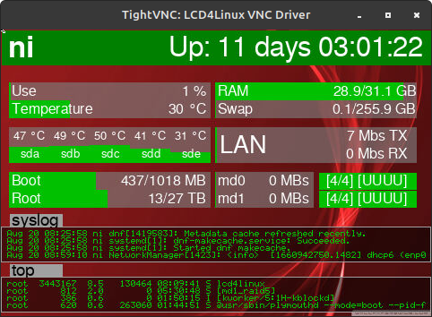

# LCD4Linux supporting current RHEL like systems and improved AX206 DPF options

This is a fork of [MaxWiesel's lcd4linux-max](https://github.com/MaxWiesel/lcd4linux-max) to address my fustrations with trying to use that software.

The best source for information about LCD4Linux appears to be [The unoffical LCD4Linux Wiki](https://wiki.lcd4linux.tk/doku.php/start).

I also have another repo, https://github.com/ukoda/ax206vncclient, that provides an AX206 VNC client that can be paired up with the LCD4Linux VNC server display driver.  When paired with display mirroring feature added in this repo it makes for an easy way to have an AX206 on a server in a rack and see the same information on a remote AX206 display.

## Objectives

Make it easier to build this software on Rocky, Mint, RPi and OpenWRT for support of USB LCD displays and add new options in support of those displays.

My focus is using the now commonly available 3.5" USB LCD displays that are offered at many online stores as 'AIDA64' displays.  These are more correctly called AX206 displays, hence the repo name, see the warning below before buying a display for use with LCD4Linux.  

As an example here is a screen capture of a VNC client mirroring the physical AX206 display on a remote server showing some of the imporved graphics features:


More details below.

## Current status

- Now building and working on Rocky 8.6 and Mint with DPF, X11 and VNC drivers.
- Now building and working on native Raspberry Pi with DPF driver.
- Added display mirroring feature.
- Added a graphics based bar graph.
- Improved TrueType Widget
- Improved SQL plugin
- Added brightness setting and plugin

See below for details on added features.

## Warnings

I am an embedded systems engineer more used to writing C code for bare metal systems and basic Posix tools.  The way I do things here may not be the proper way for such a project but the lack of documentation in the original project left me unable to simply build a binary I needed.  Therefore I have simply done what works for me.  If you don't like it I would refer you back to the original project.  I will try and make commits somewhat atomic so they may still be of use in other forks as a reference for potential changes.

An example of the troubles you may have is the first commit was to replace all the C files tabs with spaces.  This was because when I opened the source files with Sublime and the indentation looked terrible.  The core reason is that Sublime, in both it's default settings and my personal prefrences, has a different number of spaces that a tab represents from whatever the original project expects.  I'm sure there is a standards for this but I have only been coding since 1978 so I am yet to work out what that standard is.  However I have found if you set the tab to your prefered indentation as spaces only then all is good with the world and all editors just work.  My pedantic attitude about this is likely to break the ability to merge with the upstream fork, sorry, thems the breaks if you want to use this code.

Be aware that AIDA64 is actually Windows software, not the displays themselves.  So while LCD4Linux will work with the 3.5" AIDA64 displays I have purchased so far it will not work 5" AIDA64 displays as these are actaully HDMI.  The 3.5" USB displays are using the AX206 chipset designed for photo frames but can be hacked for general use.  All 3.5" USB displays I have purchased so far have the correct firmware for use with LCD4Linux as this appears to be what the AIDA64 software needs.  Searching online for AX206 displays yields few results so you are better searching for AIDA64 displays then filtering for USB versions only.

## Core issues addressed

- The generic install instructions don't work.  The default build system tools are ver 1.14 but the current versions in Rocky (cicia 2022) are version 1.16 so moved the build system to use that.
- Code, for AX206 display atleast, uses libusb version 0.1 where as Rocky currently uses 1.0 and gets really pissy if you try to install 0.1 so I updated the DPF source code to use 1.0 USB libraries.

## Core issues to address

- The confiuration options used by lcd4linux at runtime were originally conceived for mono text LCDs, not colour graphics LCDs.  There are bugs with some colour names, such as 'white', not working.  These can be worked around but I wish get to the bottom it so common sense conf files can be used.

### Variables not being defined

If in the Variables you have:
```
Variables {
    blue      '0000ff'
    std_fg     blue
}
```
Then std_fg will have the value '0000ff'.

However if in the Variables you have:
```
Variables {
    white      'ffffff'
    std_fg     white
}
```
Then stg_fg will have the value ''.

It would appear values are evaluated in alphabetical order, not defintion order.  I have not seen this behaviour documented anywhere.

### New widget acting strange

In creating a new widget it may act strangle.  The problem occurs if you define your "typedef struct WIDGET_MYNEWWIDGET" wrong.  Undocumented is that some code assumes your widget is a WIDGET_IMAGE so will be expecting things like 'gdImage' to be in the same place in your structure.  Risk fields appear to be down to the 'visible' property.

Building
========

These are the additions to the generic instructions that I needed in able to build the project.

## Rocky

This will probably apply to similar RHEL distros.

In my case I found it helped to install these packages:
- dnf group install "Development Tools"
- dnf install ncurses-devel ncurses
- dnf install libX11-devel
- dnf install gd-devel.x86_64
- dnf install libjpeg-turbo-devel
- dnf install libusb-devel
- dnf install mariadb-connector-c-devel

If usblib-devel doesn't work try usblib*

Configure the build enviroment. To keep it simple I configured only for the DPF driver, which is the one that supports AX206 displays. From the top level of the repo directory:
- aclocal
- libtoolize --copy --force 
- autoheader
- automake --add-missing --copy --foreign 
- autoconf
- ./configure --with-drivers=DPF
- touch lcd4linux.c;make

NB: I found there is script called `bootstrap` that is probably intended to do the build enviroment stuff and that you may find works the same as the above steps, except the last step.

You can also support the X11 driver using:
- ./configure --with-drivers=DPF,X11

If you want to use the VNC driver you will probably need:
- dnf -y install dnf-plugins-core
- dnf upgrade
- dnf -y install https://dl.fedoraproject.org/pub/epel/epel-release-latest-8.noarch.rpm
- dnf config-manager --set-enabled powertools
- dnf install libvncserver libvncserver-devel

### Starting with systemd

To start with systemd you will need to create a service file.  This should work on most recent Linux systems but the contents may need to change depending on the OS and where LCD4Linux is installed to etc.

Here is what I did to get LCD4Linux working on a Rocky server:
- created the file `/etc/systemd/system/lcd4linux.service`
- `systemctl daemon-reload`
- `systemctl start lcd4linux.service`
- `systemctl enable lcd4linux.service`

In my `/etc/systemd/system/lcd4linux.service` I put:
```
[Unit]
Description = LCD4Linux status display
After = network.target
StartLimitIntervalSec = 0

[Service]
Type = simple
ExecStart = /usr/local/bin/lcd4linux -F
User = root
Restart = on-failure
RestartSec = 15
StandardOutput = syslog
StandardError = syslog

[Install]
WantedBy = multi-user.target
```

## Mint

This will probably apply to similar Ubuntu distros.

In my case I found it helped to install these packages:
- sudo apt install libtool-bin libmysqlclient-dev libgd-dev libvncserver libx11-dev libusb-1.0-0-dev

Configure the build enviroment. To keep it simple I configured only for the DPF driver, which is the one that supports AX206 displays. From the top level of the repo directory:
- aclocal
- libtoolize --copy --force 
- autoheader
- automake --add-missing --copy --foreign 
- autoconf
- ./configure --with-drivers=DPF
- touch lcd4linux.c;make

You can also support the X11 driver using:
- ./configure --with-drivers=DPF,X11

## Raspberry Pi native build

Installing on a Raspberry Pi was done by building on the RPi, not crosscompling from an x86 work station.

I need to install:
- sudo apt install libtool-bin
- sudo apt install gettext
- sudo apt install libusb-1.0-0-dev
- sudo apt install libncurses-dev
- sudo apt install libgd-dev
- sudo apt install libmariadb-dev-compat

Used the bootstrap script to set up enviroment and build:
- ./bootstrap
- ./configure --with-drivers=DPF
- touch lcd4linux.c;make

## Raspberry Pi cross compile build

NB: Not working yet.

In this case we are using a Mint x64 system to cross compile for a RPi.  Unlike a native build we need to know if we are building for a tradtional 32 bit RPi or a newer 64 bit model such as the RPi 4 or CM4.

I installed:
- For 32 bit: sudo apt install crossbuild-essential-armhf
- For 64 bit: sudo apt install crossbuild-essential-arm64

For a 32 bit build I used the bootstrap script to set up enviroment and build:
- ./bootstrap
- ./configure --with-drivers=DPF --host arm-linux-gnueabihf
- make

NB: It failed during linking looking for gd, usb-1.0 and dbus-1.  See https://askubuntu.com/questions/611822/help-with-cross-compiling-for-arm for a potential solution.

Config file information
=======================

The best documentation I have found on the configuration file is at [The unoffical LCD4Linux Wiki](https://wiki.lcd4linux.tk/doku.php/start).  Here I have added information I could not find there.

## Upstream repo

This is things that this code has inherited from the up stream repo.

### Display settings

The `backlight` setting is not linear and will simply blank the display or flicker at low values making it difficult to use in low light appliactions such as a bed side night display.  To improve this a new `brightness` setting has been added with the range 0 to 100, and with 100 as the default.  It scales the pixel values as a percentage.  You would normally set lowest value backlight setting that gives a stable backlight that supports the brightest white you need, then use the brightness value to dim it to suit the user needs.  NB:While the brightness setting can be used to dim with any backlight level setting the backlight higer than needed will lead to light bleed on black areas of the screen.

### Display Plugins

The display has an undocumented `LCD::backlight` plugin that you would normally call from a Timer Widget, https://wiki.lcd4linux.tk/doku.php/widget_timer, to adjust the backlight brightness during operation.

I have also added a `LCD::brightness` plugin to set the pixel brightness in the same way.

### TrueType Widget

The most notable of these is the widget class TrueType from Eric Loxat.  Having discovered this I realsied it will save me a lot of work with plans I had on improving the larger font appearance with the AX206 displays, thanks Eric.

For the Widget declaration the fields appear to be:
- `class`: Must be 'Truetype'.
- `expression`: The expression for the text to display.
- `font`: The full path the True Type font to use.
- `size`: The height of the font, not including decenders, not in pixels.
- `width`: The width of the box in pixels to fit the text, not the character width, see below.
- `height`: The height of the box in pixels to fit the text, see below.
- `align`: Horizontal alignment of 'L', 'C' or 'R'.
- `center`: Doesn't appear to do anything.
- `fcolor`: Font color as RGB or RGBA.  The background is transparent unless `background` is defined.
- `inverted`: Inverts the fcolor value e.g. '0000ff' would become 'ffff00'.
- `update`: Update time in mS, as per other widgets.
- `visible`: Visiblity,  as per other widgets.
- `debugborder`: The colour to use to show the bounding box.  If black or ommited will not be rendered.

I have added to this widget these fields:
- `background`: Background color as RGB or RGBA.  If not defined the background is transparent.


NB: If `size` is ommited or 0 the largest font size that will fit in the `width` x `height` box will be used depending on what limited is reached first.  If the font `size` is given the text will be cropped to fit the box if it too big.  The text is always vertically center alligned, ignoring decenders.  While expermenting with layouts setting `debugborder` to 'ffffff' can be handy.

An example:
```
Widget Debug {
    class 'Truetype'
    expression 'Test'
    font '/usr/share/fonts/gnu-free/FreeSans.ttf'
    width 60
    height 80
    fcolor 'ffffff'
}
```

For the layout section the same X Y position format used by images should be used.

### SQL plugin

Fixed bug where display was not show SQL results if SQL server was restarted.

## Repo specific additions

This is extensions not present in the upstream repo.

### TrueType Widget

Added `background` field, see above Upstream repo TrueType Widget for more detail.

### Driver mirroring

This allows a second driver to mirror the normal driver.  Intended use case is where machine has a local physical display, such as an AX206, and you wish to view that screen remotely via VNC or X11.

Mirror driver must be different from the main driver and both must be graphics displays with the same resolution.

To use you will need to have two `Display` driver defintion sections and add a `Mirror` declaration to point to one of the defined drivers.

NB: It has currently only been tested with the DPF driver paired with a VNC or X11 driver.  Other combinations may break things.  Where the Mirror declartion is absent I do not expect problems with anything.  There is an unresolved issue with drv_quit() in drv.h but it does not currently seem to cause problems.  You will also see warnings about duplicate widgets but again this does not appear to cause problems.

An example:
```
# A very simple mirror example configuration for lcd4linux

Layout  'Compact' 

Display 'DPF'
Mirror  'VNC'

Variables {
    _black '000000'
    _white 'ffffff'
}

Display dpf {
    driver      'DPF'
    port        'usb0'
    font        '6x8'
    orientation 0
    backlight   4
    foreground  _white
    background  _black
    basecolor   _black
}

Display VNC {
    Driver       'VNC'
    Font         '6x8'
    Port         '5900'
    Xres         '480'
    Yres         '320'
    Bpp          '4'
    Maxclients   '2'
    Osd_showtime '2000'
}

Widget Uptime {
    class      'Truetype'
    expression 'Uptime: ' . uptime('%d days %H:%M:%S')
    font       '/usr/share/fonts/gnu-free/FreeSans.ttf'
    size       24
    width      480
    height     100
    fcolor     _white
    reload     '1'
    update     1000
}

Layout Compact {
    layer 1 {
        X100.Y1 'Uptime'
    }
}
```

### GraphicBar Widget

The original Bar widget is optimised for use on text displays and therefore is a compromise on graphics displays.  I have added a new widget type, for graphics displays only, call GraphicBar.  Key differences from the text Bar are:
- There is only one value.  The two values on the text Bar are a kludge to make the most of the limitation of text displays and is a needless complication on graphics displays.
- The bar size and postions are pixel based instead of character based.
- The bar can have a negative minimum value and will start the bar from the effective 0 point, reversing direction for negative values.
- The bar can change colors above or below set value thresholds.  For example a CPU usage graphic bar could be green at low loads, turning yellow under moderate loads and red under high loads.

For the Widget declaration the fields are:
- `class`: Must be 'GraphicBar'.
- `expression`: The expression for the bar value to display.
- `length`: The length of the axis the bar moves along, in pixels.
- `width`: The width or thickness of the bar in pixels.
- `direction`: The direction of the bar travel, for positive values, 'N', 'E', 'S' or 'W'.  Default is 'E'.
- `min`: The value for the minimum end of the axis, may be negative.  If missing will auto range.
- `max`: The value for the maximum end of the axis, should be higher than `min`.  If missing will auto range.
- `color`: The nominal bar color as RGB or RGBA.  Defaults to bright green.
- `background`: Background color as RGB or RGBA.  Defaults to dark gray.
- `valuelow`: If defined sets the value below which the `colorlow` is used for the bar.
- `colorlow`: The bar color as RGB or RGBA to use when the value is below `valuelow`.
- `valuehigh`: If defined sets the value above which the `colorhigh` is used for the bar.
- `colorhigh`: The bar color as RGB or RGBA to use when the value is above `valuehigh`.
- `style`: If set to 'H' will draw a hollow bar, otherwise it is the default solid bar.
- `update`: Update time in mS, as per other widgets.

### precision function

Added a precision function to the maths library.  It is intened to add tailing zeros to floating point number so columns of them line up nicely.  The first argument is the value to be formated and the second argument is the number of trailing digits needed.  It should be noted that the output is a sting, not a number, so it would be used after any maths was done.

An example of its usage:
- `expression  precision(file::readline(F_PW, 3), 3) . ' kW '`
